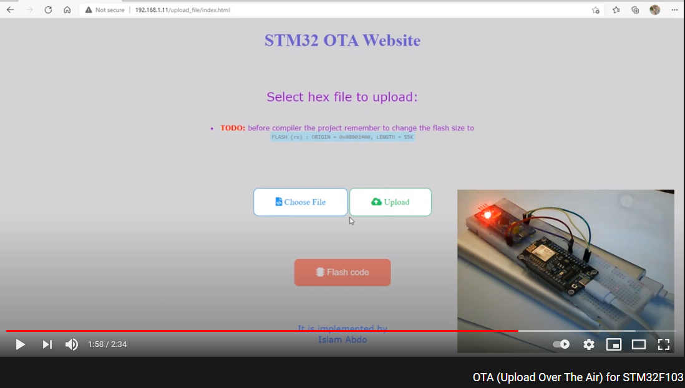

# OTA (Upload Over The Air) for STM32F103
This project is implemented to program BlueBill Board (STM32 Micro-controller)
over the air using a website with ```PHP``` and NodeMCU board to get the code
from the internet and sending it to STM to write it into the Flash Memory
using the Bootloader flashed on the first 9 kB of Flash Memory.


## project video [*(click here)*](https://youtu.be/M2U45CHqeEk)
[](https://youtu.be/M2U45CHqeEk)


## Hardware Required
- STM32F103 BlueBill Board
- NodeMCU V1.0 Board


## Connection

| nodemcu / Esp8266 | STM32F103      |
| -------------     | -------------  |
| TX                | PA10           |
| RX                | PA9            |
| GND               | GND            |


## The project is divided into three mini-projects
### 1. [Website](http://iot-arm.freevar.com/)
The website is responsible for letting the user upload a .hex file to Server to be ready to be received by NodeMCU.
The website only allows ```.hex``` to be uploaded.

- **TODO:** before compiler the project remember to change the flash size to:
  -  ```FLASH (rx) : ORIGIN = 0x08002400, LENGTH = 55K ``` .


### 2. NodeMCU
Once a new ```.hex``` file is uploaded to Server, and reset STM , NodeMCU reads file content line by line to try sending it STM through UART.


### 3. STM
On reset, STM Bootloader waits for 5 seconds if there is any code received from NodeMCU.
 If any, it will first erase the application area and then flash the code received.
Once it finished, it will run the application code after 5 seconds.
If no code received from NodeMCU for 5 seconds, it will jump to latest flashed application code.
- **NOTE:**  
  - you need to edit SSID & PASSWORD  (and if needed IPserver & Website) in ```main.h``` file.
  - I used local PHP Server because the free online server take much time to flash the code.
  - size of Bootloader changed in ```FPEC_config.h``` file.
## AT-COMMAND for Esp8266/nodemcu
1. ``` AT ``` >>> TEST AT.
2. ``` ATE0 ``` >>> STOP ECHO.
3. ``` AT+RST ``` >>> SOFTWARE RESET.
4. ``` AT+CWMODE=1 ``` >>> SET STATION MODE.
5. ``` AT+CWJAP="SSID","PASSWORD" ``` >>> CONNECT TO WIFI (*set SSID & PASSWORD*).
6. ``` AT+CIPSTART="TCP","serverIP",80 ``` >>> (*replace serverIP with the website ip* ) to start connect on server ex: ```162.253.155.226```).
7. ``` AT+CIPSEND=numOfBits+1 ``` >>> send data length (*replace numOfBits with number of http link bits with ```GET``` word* ).
8.  ```GET http://iot-arm.freevar.com/start_flash.php?config=ok ``` >>>  put link of website.
9. Rebeat again from line number ```7``` of  ```"AT+CIPSTART"``` because connection will closed after receive data.
- **NOTE:** you receive data as form: ``` +IPD,LengthOfData:content....CLOSED ```.
